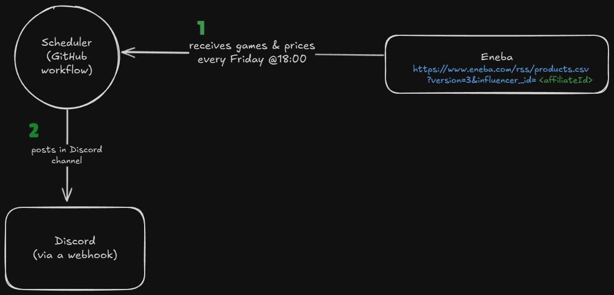

This repository consumes Eneba offers from an affiliate CSV and produces message towards Discord using Discord server webhook.

I have a workflow to do this on a logical schedule. It also works with local values/CSV.

